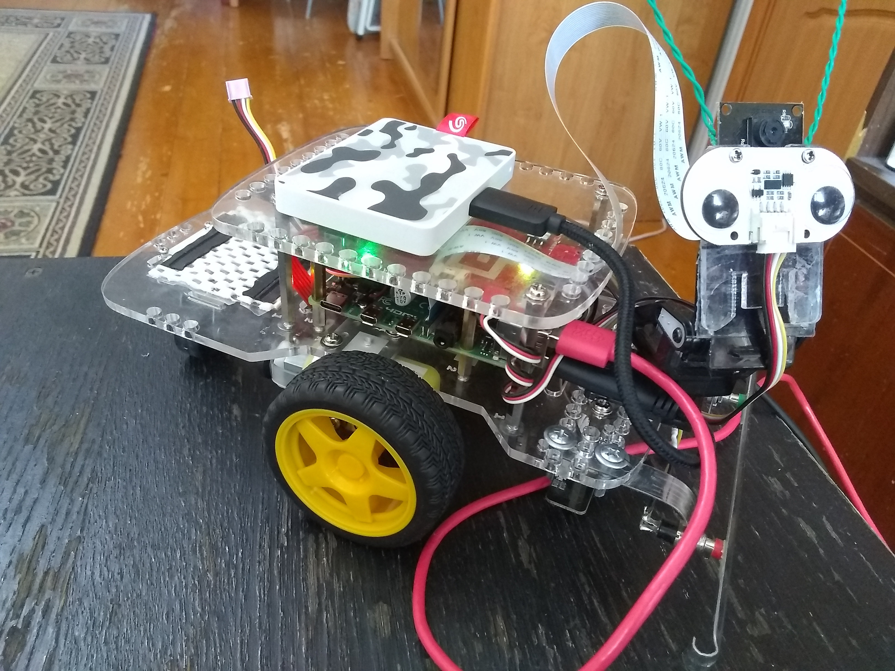

# New Remote Camera Robot
### Note that this is *experimental code*, it is *NOT* for general use, and *will change without notice!*
You can use this code if you want, but it is ***NOT*** guaranteed to work and will be changing almost continuously as I work on it.&nbsp; Do not submit issues as they will be ignored and closed.

## Project Overview:

This project is a modification of the original [Remote Camera Robot](https://https://github.com/DexterInd/GoPiGo3/tree/master/Projects/RemoteCameraRobot) project as developed by Dexter Industries for my GoPiGo-3 robot.

This currently works with a Saitek X52 joystick.  I hope to add support for
additional joysticks and/or a joystick configuration file.

## Objectives:

1. Develop an application that will allow the GoPiGo robot to be used as a FPV robot using a joystick controller instead of a mouse/touchscreen.
   * My experience with the original code using nipple.js as the controller showed me that there was an incredible lack of precision and control over the robot's movements.
   * I am hoping to create a controller interface that will provide more delicate and precise control over the robot's movements and allow the POV to be changed by moving the camera on the robot's pan-and-tilt.
2. Learn how to implement both server-side and client-side web application programming.
   * Can I effectively control and manage the web-data being sent from the browser to the robot?
   * Can I create a method where the robot can return specific status information, (like battery voltage, processor temp, or whatever), that will be overlaid on the browser's screen?
3. Learn how to use the various programming tools efficiently and correctly.
   * VS-code
      * Remote development on the actual robot from within my Windows 10 laptop.
      * Learn how to use the various VS Code features and extensions to help create and manage a project.
   * Git/GitHub
      * Learn how to manage and maintain a project on GitHub using Git and the Git extensions within VS Code.

## Stretch Goals:
1. Modify the code to work with https requests to prevent the joystick from being blocked by browser policies.
   *  Completed by purchasing a domain and a SSL certificate and using NGINX as a reverse proxy.
2. Provide a way to configure joystick/gamepad button mapping via an external configuration file.
   *  Completed.  Added gamepad_config.json file and modified the javascript to read and parse it.
3. Provide a default mapping for "standard" gamepads.
   *  Completed - subsumed into item 2.
4. Provide status messages from the robot to the client browser as right now the status panel is populated by the browser itself, not the robot.
   *  I am currently investigating Server Sent Events as a mechanism to accomplish this.
5. (Fun update, not critical) Provide a graticule with a moving "pipper" like those seen on attack helicopter displays.

## Challenges:

### Primary Limitations

1. My absolute lack of knowlege about just about every aspect of this project.
   * This is my ***FIRST*** robotics project of ***ANY*** complexity.
   * This represents my second or third project in Python, and is my first project of any significant complexity in the language.
   * This represents my ***FIRST*** project of ***ANY*** complexity in JavaScript.
   * This is my first "complex" project managed within GitHub.
   * This is my first web-based project.
2. The technical landscape of the project is shifting under me as I am working on it.
   * The security model for the gamepad API is changing on almost a daily basis.
      * The gamepad API is now requiring a secure context, (*i.e.* a "HTTPS" context), in order to work.  Previously, any web context was valid.
   * The security model for the browser itself is shifting almost as quickly.
      * It was necessary for me to research and then include CORS (Cross Origin Resource Sharing) headers within the server code so that the browser was allowed to access the other resources needed for the project.
      * Browser security is shifting rapidly to an almost fully locked-down security model where everyting will need to be served from a "secure" source via HTTPS.
   * Updates to the robot's operating system have mandated changes to the project, or changes to the robot's configuration to accomodate the project.

### Coding Challenges

1. The gamepad API doesn't have a generic event for joystick activity.
   * The gamepad browser API was, (apparently), designed to be used as an interface for ***games*** within the browser so the primary way of getting information is to poll the gamepad using the requestAnimationFrame() function which loops every v_sync interval. (about 60 times a second)
   * The result of all this is that it is very difficult to manage gamepad activity in a server-based context as the server gets flooded with responses from the browser.
      * I can regulate the amount of data being sent to the server by looping within the browser script waiting for the controller.time_stamp to increment.  This causes the browser to become sluggish or hang.
      * I can delegate all the filtering to the server, wich wasts resources on the robot, slowing things down.
      * I can create a "web worker" - a separate process - that will handle polling the gamepad controller interface and then notify the main process when someting happens.&nbsp; However. web worker threads do not have access to the main DOM context so they cannot interact direcctly with the joystick/gamepad.&nbsp; Therefore I have absondoned that effort for the time being.
    *  My current ploan of attach is a modification of the first point.&nbsp; My current plan is to allow the program to progress the way it has been - flooding the server - but instead of transmitting all the data blindly, to create a "gateway" condition for the sending of data:&nbsp; Has the data changed?&nbsp; If so, send it.&nbsp; If not, pass the send routine and loop to get more data and try again.

-- EOF --
